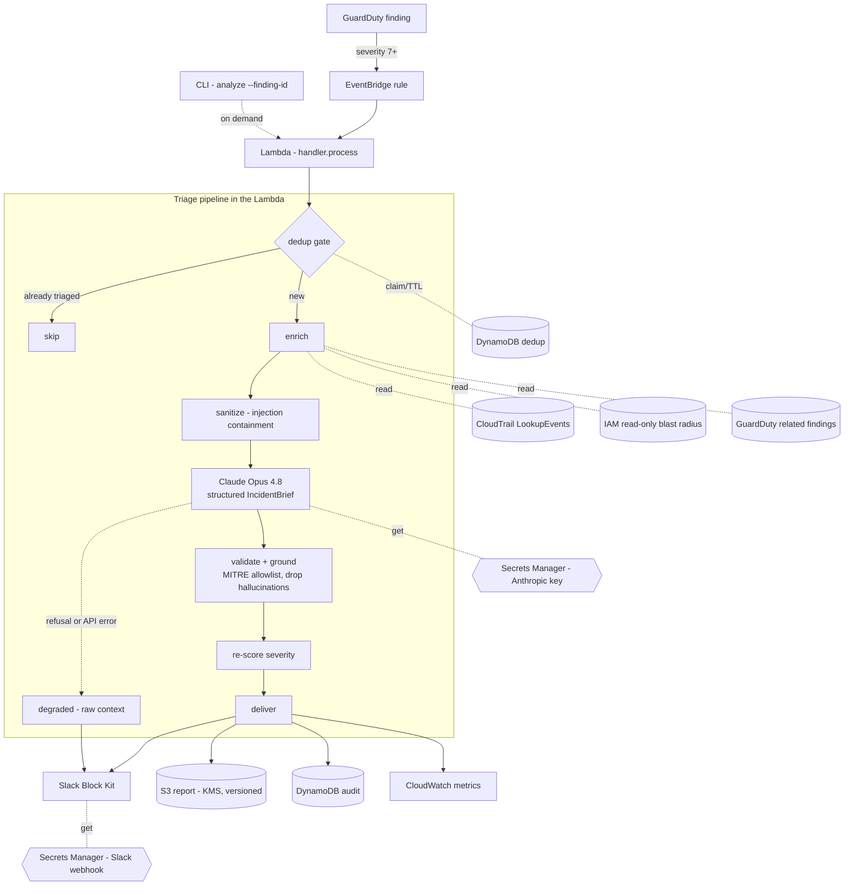

# Architecture

CloudSentinel is a single AWS Lambda that orchestrates a deterministic pipeline
around one LLM call. Everything is event-driven and stateless per-finding; all
durable state lives in managed AWS services.

## End-to-end flow



## Stages

| Stage | What it does | Why it matters |
|---|---|---|
| **Trigger** | EventBridge matches GuardDuty findings with `severity ≥ 7` and invokes the Lambda. The CLI is an alternate, on-demand entry to the same code. | Severity gate is a noise filter; threshold is configurable. |
| **Dedup gate** | Atomic conditional `PutItem` (+ TTL) in DynamoDB. | EventBridge is at-least-once and GuardDuty re-emits; each finding is triaged exactly once. |
| **Enrich** | Pulls the CloudTrail timeline (by AccessKeyId), the principal's IAM blast radius, and related findings. Every sub-lookup is best-effort. | Turns a bare finding into the real story; a failure degrades one section, not the triage. |
| **Sanitize** | JSON-encodes all untrusted telemetry, strips control/format characters, wraps in delimiters it can't escape. | The prompt-injection boundary — containment, not detection. |
| **Claude Opus 4.8** | `messages.parse` with a flat `IncidentBrief` schema, adaptive thinking, a cacheable system prompt. Key fetched from Secrets Manager. | Structured, grounded analysis; refusals/errors fall to degraded mode. |
| **Validate + ground** | Rejects invented MITRE ATT&CK IDs (allowlist) and drops resources absent from the evidence; one retry then degrade. | Guarantees the *content*, not just the JSON shape. |
| **Re-score** | Deterministically combines GuardDuty severity, blast radius, related-findings count, and the model's proposal. | Explainable, reproducible severity that's never below the hard signals. |
| **Deliver** | Slack Block Kit brief + full JSON to S3 + audit row to DynamoDB + CloudWatch metrics. | Human-readable alert, durable artifact, queryable audit, observability. |
| **Degraded** | On refusal/error/unreadable key, posts the raw enriched context to Slack, flagged. | The triage never silently drops. |

## Trust boundaries

- **Untrusted → model.** Everything in the enrichment bundle is adversary-influenceable.
  The sanitizer makes it structurally impossible for any value to escape the
  `<untrusted_data>` region of the prompt.
- **Lambda → AWS.** The execution role is read + notify only: no `iam:*` writes, no
  compute mutation, no deletes, no remediation. A compromised analyzer can post a
  Slack message; it cannot touch infrastructure.
- **Secrets.** The Anthropic key and Slack webhook exist only in Secrets Manager,
  read at runtime via the scoped role; never in code, env files, or Terraform state.

## Data stores

| Store | Contents | Notes |
|---|---|---|
| DynamoDB `cloudsentinel-dedup` | one row per triaged finding | TTL-pruned; PK `finding_id` |
| DynamoDB `cloudsentinel-audit` | compact record per triage | PK `finding_id`, SK `timestamp` |
| S3 `cloudsentinel-reports-<acct>` | full finding + enrichment + brief JSON | KMS SSE, versioned, TLS-only, public access blocked |
| CloudWatch (namespace `CloudSentinel`) | latency, tokens, est. cost, failures | drives the dashboard |
```
